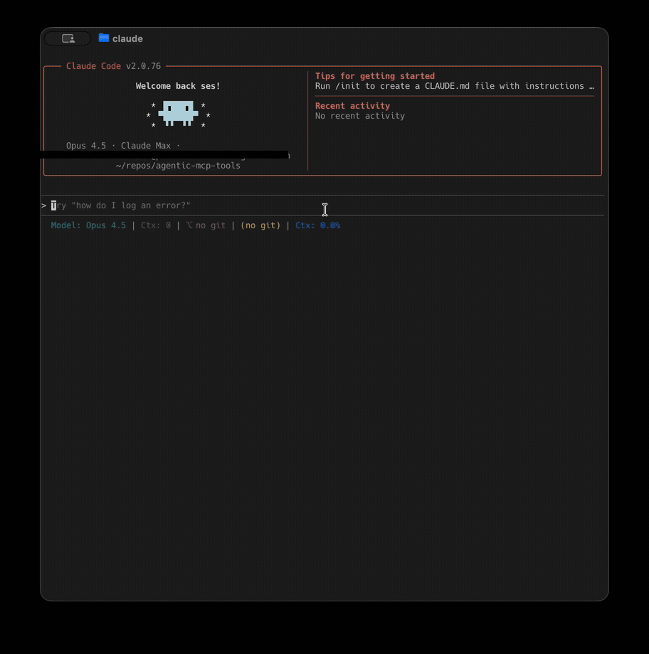

# Owlex

[](https://github.com/jonastbrg/owlex/releases)
[](LICENSE)
[](https://python.org)
[](https://modelcontextprotocol.io)

**Multi-agent AI orchestration for Claude Code.**

Owlex provides access to 5 AI agents (Codex, Gemini, OpenCode, Grok, ClaudeOR) directly from Claude Code. Use them for council deliberation, peer-reviewed coding, or individual sessions with session persistence.



## How the Council Works

1. **Round 1** - Your question goes to each agent independently. They answer without seeing each other.
2. **Round 2** - Each agent sees all Round 1 answers and can revise their position.
3. **Synthesis** - Claude reviews everything and outputs a structured answer.

Use it for architecture decisions, debugging tricky issues, or when you want more confidence than a single model provides. Not for every question - for the ones that matter.

## Capabilities at a Glance

| Feature | Description |
|---------|-------------|
| **Council** | Multi-agent deliberation with 2-round revision |
| **Liza** | Peer-supervised coding with binding review verdicts |
| **5 Agents** | Codex, Gemini, OpenCode, Grok, ClaudeOR |
| **Roles/Teams** | Assign specialist perspectives (security, perf, skeptic) |
| **Session Persistence** | Resume conversations across sessions |
| **Async Tasks** | Background execution with status polling |

## Installation

```bash
uv tool install git+https://github.com/jonastbrg/owlex.git
```

Add to `.mcp.json`:

```json
{
  "mcpServers": {
    "owlex": {
      "command": "owlex-server"
    }
  }
}
```

## Usage

### Council Deliberation

```
council_ask prompt="Should I use a monorepo or multiple repos for 5 microservices?"
```

Options:
- `claude_opinion` - Share your initial thinking with agents
- `deliberate` - Enable Round 2 revision (default: true)
- `critique` - Agents critique each other instead of revise
- `roles` - Assign specialist roles: `{"codex": "security", "gemini": "perf"}`
- `team` - Use preset: `security_audit`, `code_review`, `architecture_review`, `devil_advocate`, `balanced`
- `timeout` - Timeout per agent in seconds (default: 300)

### Roles & Teams

Assign specialist perspectives for focused deliberation:

**Built-in Roles:**
| Role | Focus |
|------|-------|
| `security` | Vulnerabilities, attack vectors, hardening |
| `perf` | Performance, scalability, optimization |
| `skeptic` | Find flaws, challenge assumptions |
| `architect` | Design patterns, maintainability |
| `maintainer` | Technical debt, long-term costs |
| `dx` | Developer experience, usability |
| `testing` | Test coverage, edge cases |

**Team Presets:**
```python
council_ask(prompt="Review this auth flow", team="security_audit")
council_ask(prompt="Architecture options?", team="architecture_review")
```

### Individual Agent Sessions

| Tool | Description |
|------|-------------|
| `start_codex_session` | New Codex session |
| `resume_codex_session` | Resume with session ID or `--last` |
| `start_gemini_session` | New Gemini session |
| `resume_gemini_session` | Resume with index or `latest` |
| `start_opencode_session` | New OpenCode session |
| `resume_opencode_session` | Resume previous session |
| `start_grok_session` | New Grok session (reasoning or coding model) |
| `resume_grok_session` | Resume previous Grok session |
| `start_claudeor_session` | New ClaudeOR session (OpenRouter backend) |
| `resume_claudeor_session` | Resume previous ClaudeOR session |

### Async Task Management

Council runs in the background. Start a query, keep working, check results later.

| Tool | Description |
|------|-------------|
| `wait_for_task` | Block until task completes |
| `get_task_result` | Check result without blocking |
| `list_tasks` | List tasks with status filter |
| `cancel_task` | Kill running task |

## Configuration

| Variable | Default | Description |
|----------|---------|-------------|
| `COUNCIL_EXCLUDE_AGENTS` | `` | Skip agents (e.g., `opencode,gemini,grok`) |
| `COUNCIL_DEFAULT_TEAM` | `` | Default team preset for council |
| `OWLEX_DEFAULT_TIMEOUT` | `300` | Timeout in seconds |
| `CODEX_BYPASS_APPROVALS` | `false` | Bypass sandbox (use with caution) |
| `GEMINI_YOLO_MODE` | `false` | Auto-approve Gemini actions |
| `OPENCODE_AGENT` | `plan` | `plan` (read-only) or `build` |
| `GROK_MODEL` | `xai/grok-4-1-fast-reasoning` | Grok reasoning model |
| `GROK_CODE_MODEL` | `xai/grok-code-fast-1` | Grok coding model |
| `XAI_API_KEY` | `` | xAI API key for Grok |
| `CLAUDEOR_MODEL` | `` | Model for ClaudeOR (OpenRouter) |

## Cost Notes

- **Codex** and **Gemini** use your existing subscriptions (Claude Max, Google AI Pro, etc.)
- **OpenCode** uses API tokens
- Exclude agents with `COUNCIL_EXCLUDE_AGENTS` to control costs
- Use council for important decisions, not every question

## Liza: Peer-Supervised Coding

**External validation for production-quality code.**

Liza implements a peer-review loop where Claude (the coder) implements tasks and external agents (Codex, Gemini, Grok) review with binding verdicts. Based on [liza-mas/liza](https://github.com/liza-mas/liza).

### Architecture

```
┌─────────────────────────────────────────────────┐
│          Claude Code (Coder + Orchestrator)      │
└─────────────────────────────────────────────────┘
                        │
                [implementation]
                        │
          ┌─────────────┼─────────────┐
          ▼             ▼             ▼
    ┌─────────┐   ┌─────────┐   ┌─────────┐
    │  Codex  │   │ Gemini  │   │  Grok   │
    │(Reviewer│   │(Reviewer│   │(Reviewer│
    └─────────┘   └─────────┘   └─────────┘
```

### Workflow

```
1. liza_start("Add rate limiting") → task_id
2. Claude implements (Write/Edit/Bash)
3. liza_submit(task_id, summary) → reviewers examine
   - Codex: REJECT - "Missing IP-based limiting"
   - Gemini: APPROVE
4. Claude fixes based on feedback
5. liza_submit again → all APPROVE
6. Done! ✅
```

### MCP Tools

| Tool | Description |
|------|-------------|
| `liza_start` | Create a task for Claude to implement |
| `liza_submit` | Submit implementation for review |
| `liza_status` | Check task status |
| `liza_feedback` | Get feedback to address |

### Key Principles

- **External validation**: Claude cannot self-approve
- **Critique mode**: Reviewers actively find bugs, security issues, edge cases
- **Multi-reviewer**: Different agents catch different issues
- **Iteration**: Loop until all reviewers approve or max iterations

---

## When to Use Each Agent

| Agent | Strengths |
|-------|-----------|
| **Codex** | Deep reasoning, code review, bug finding, PRD writing |
| **Gemini** | 1M context window, multimodal, large codebases |
| **OpenCode** | Alternative perspective, configurable backend models |
| **Grok** | Contrarian perspective, reasoning model + coding model |
| **ClaudeOR** | Claude via OpenRouter, alternative model access |
| **Claude** | Complex multi-step implementation, synthesis, orchestration |

## Architecture

```
┌─────────────────────────────────────────────────────────────┐
│                      Claude Code (MCP Client)                │
└─────────────────────────────────────────────────────────────┘
                              │
                              │ MCP Protocol
                              ▼
┌─────────────────────────────────────────────────────────────┐
│                      Owlex MCP Server                        │
├─────────────────────────────────────────────────────────────┤
│  Council          │  Liza              │  Individual        │
│  Deliberation     │  Peer Review       │  Sessions          │
├───────────────────┴──────────────────────────────────────────┤
│                      Agent Engine                            │
├──────┬──────┬──────────┬──────────┬────────────────────────┤
│Codex │Gemini│ OpenCode │   Grok   │       ClaudeOR         │
│ CLI  │ CLI  │   CLI    │  (xAI)   │     (OpenRouter)       │
└──────┴──────┴──────────┴──────────┴────────────────────────┘
```
