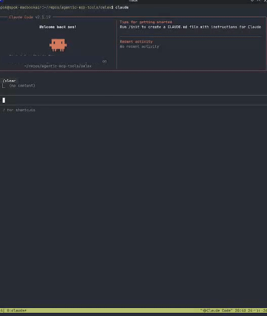

# Owlex

[](https://github.com/agentic-mcp-tools/owlex/releases)
[](LICENSE)
[](https://python.org)
[](https://modelcontextprotocol.io)

**Get a second opinion without leaving Claude Code.**

Different AI models have different strengths and blind spots. Owlex lets you query Codex, Gemini, and OpenCode directly from Claude Code - and optionally run a structured deliberation where they review each other's answers before Claude synthesizes a final response.



## How the Council Works

1. **Round 1** - Your question goes to each agent independently. They answer without seeing each other.
2. **Round 2** - Each agent sees all Round 1 answers and can revise their position.
3. **Synthesis** - Claude reviews everything and outputs a structured answer.

Use it for architecture decisions, debugging tricky issues, or when you want more confidence than a single model provides. Not for every question - for the ones that matter.

## Installation

```bash
uv tool install git+https://github.com/agentic-mcp-tools/owlex.git
```

Add to `.mcp.json`:

```json
{
  "mcpServers": {
    "owlex": {
      "command": "owlex-server"
    }
  }
}
```

## Usage

### Council Deliberation

```
council_ask prompt="Should I use a monorepo or multiple repos for 5 microservices?"
```

Options:
- `claude_opinion` - Share your initial thinking with agents
- `deliberate` - Enable Round 2 revision (default: true)
- `critique` - Agents critique each other instead of revise
- `roles` - Assign specialist roles (dict or list)
- `team` - Use a predefined team preset
- `timeout` - Timeout per agent in seconds (default: 300)

### Specialist Roles

Agents can operate with specialist perspectives that shape their analysis:

| Role | Description |
|------|-------------|
| `security` | Security analyst - vulnerabilities, auth, data protection |
| `perf` | Performance optimizer - efficiency, caching, scalability |
| `skeptic` | Devil's advocate - challenge assumptions, find edge cases |
| `architect` | System architect - design patterns, modularity, APIs |
| `maintainer` | Code maintainer - readability, testing, tech debt |
| `dx` | Developer experience - ergonomics, documentation, errors |
| `testing` | Testing specialist - coverage, strategies, edge cases |
| `neutral` | No role injection (default) |

**Assign roles explicitly:**
```
council_ask prompt="Review this auth flow" roles={"codex": "security", "gemini": "perf"}
```

**Auto-assign from list (in agent order: codex, gemini, opencode):**
```
council_ask prompt="Review this code" roles=["security", "skeptic", "maintainer"]
```

### Team Presets

Predefined role combinations for common scenarios:

| Team | Codex | Gemini | OpenCode | ClaudeOR |
|------|-------|--------|----------|----------|
| `security_audit` | security | skeptic | architect | dx |
| `code_review` | maintainer | perf | testing | dx |
| `architecture_review` | architect | perf | maintainer | dx |
| `devil_advocate` | skeptic | skeptic | skeptic | skeptic |
| `balanced` | security | perf | maintainer | dx |
| `optimal` | maintainer | architect | dx | skeptic |

```
council_ask prompt="Is this design secure?" team="security_audit"
```

### Individual Agent Sessions

| Tool | Description |
|------|-------------|
| `start_codex_session` | New Codex session |
| `resume_codex_session` | Resume with session ID or `--last` |
| `start_gemini_session` | New Gemini session |
| `resume_gemini_session` | Resume with index or `latest` |
| `start_opencode_session` | New OpenCode session |
| `resume_opencode_session` | Resume with session ID or `--continue` |
| `start_claudeor_session` | New Claude via OpenRouter session |
| `resume_claudeor_session` | Resume with session ID or `--continue` |

### Claude Code Skills

Non-blocking slash commands for quick agent invocation:

| Skill | Description |
|-------|-------------|
| `/codex` | Ask Codex a question |
| `/gemini` | Ask Gemini a question |
| `/council` | Run council deliberation |
| `/critique` | Run council in critique mode |

### Async Task Management

Council runs in the background. Start a query, keep working, check results later.

| Tool | Description |
|------|-------------|
| `wait_for_task` | Block until task completes |
| `get_task_result` | Check result without blocking |
| `list_tasks` | List tasks with status filter |
| `cancel_task` | Kill running task |

## Configuration

| Variable | Default | Description |
|----------|---------|-------------|
| `COUNCIL_EXCLUDE_AGENTS` | `` | Skip agents (e.g., `opencode,gemini,claudeor`) |
| `COUNCIL_DEFAULT_TEAM` | `` | Default team when none specified (empty = neutral) |
| `COUNCIL_CLAUDE_OPINION` | `false` | Claude shares its opinion with agents by default |
| `OWLEX_DEFAULT_TIMEOUT` | `300` | Timeout in seconds |
| `CODEX_BYPASS_APPROVALS` | `false` | Bypass sandbox (use with caution) |
| `GEMINI_YOLO_MODE` | `false` | Auto-approve Gemini actions |
| `OPENCODE_AGENT` | `plan` | `plan` (read-only) or `build` |
| `OPENROUTER_API_KEY` | `` | OpenRouter API key (enables ClaudeOR agent) |
| `CLAUDEOR_MODEL` | `` | OpenRouter model for ClaudeOR (e.g., `deepseek/deepseek-v3.2`) |

## Cost Notes

- **Codex** and **Gemini** use your existing subscriptions (Claude Max, Google AI Pro, etc.)
- **OpenCode** uses API tokens
- Exclude agents with `COUNCIL_EXCLUDE_AGENTS` to control costs
- Use council for important decisions, not every question

## When to Use Each Agent

| Agent | Strengths |
|-------|-----------|
| **Codex (gpt5.2-codex)** | Deep reasoning, code review, bug finding |
| **Gemini** | 1M context window, multimodal, large codebases |
| **OpenCode** | Alternative perspective, configurable models |
| **ClaudeOR** | Claude Code + OpenRouter (DeepSeek, GPT-4o, etc.) |
| **Claude** | Complex multi-step implementation, synthesis |
